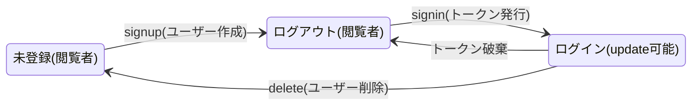

# ユーザー管理の仕様
ユーザーを作成、読み出し、変更、削除できる。既存ユーザーはログインできる。
変更、削除は権限のあるもののみ。

## API
### api/user/signup
emailとpasswordでユーザー作成。誰でも出来る。

### api/user/signin
emailとpasswordを照合する。一致するユーザーが存在した場合、当該ユーザーのIDを含むトークンを返す。以後このトークンを利用してログイン状態を実現できる。ログアウトする場合はトークンを破棄する。

### api/user/read
idまたはemailに一致するユーザー情報を返す。トークン不要。

### api/user/update
権限が必要。権限は、トークン内のIDと一致するユーザーデータ、またはadminがもつ。
パスワードを変更する場合は旧パスワードが一致すること。

### api/user/delete
IDまたはemailアドレスに一致するユーザーをDBから削除する。権限が必要。

### Userエンティティ

### ユーザーの状態遷移

